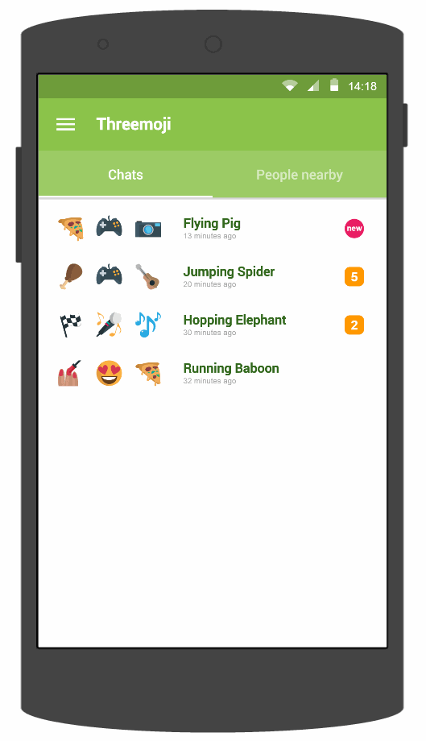

# Threemoji
For people who want to meet new people nearby, Threemoji is a social app that matches individuals with like-minded peers. Unlike Tinder, Threemoji matches people based on the 3 emojis they choose to describe themselves with and chats are all anonymous.

We are aiming for Apollo 11. [Ignition presentation][ignition-presentation]

![Threemoji][ignition-slide]

# Planned Features
 

Threemoji displays your chats sorted by their last active time. 

You will be automatically matched and a chat will be initiated for you. 

>We are still in the process of defining the meaning of match. Currently, our plan is to categorise the various emoji, where emoji of the same category will be highly similar. Each emoji will have several categories and emoji that share a higher number of similar categories will have a higher level of similarity.

>The use of generated aliases such as "Flying Pig" ensures that two people sharing the same set of emoji can be differentiated.

Notifications will prompt you whenever a match happens or when new messages arrive.
 

 

Threemoji allows you to see people nearby who were not automatically matched with you.

These people are sorted by the extent of match with you.

You can then start a chat with any of them.
>Chats will be encrypted so even the administrators will not be able to read messages.

 

 

You can change your emoji anytime to match with different people.

If you want to match with people farther away, you can change your radius of match.

Chats that are inactive for 3 weeks will be archived and they can be accessed from this side menu.
 

# Milestones
Our goal is to complete an Android application and perhaps an iOS application if time permits.

We've come up with some user stories sorted by level of priority: [User Stories]

# References
* [Proto] - Prototyping web application for making the prototypes above
* [LICEcap] - For recording gifs
* [Emoji One] - Open source emoji
* [Material Design] - Design guidelines for Android applications
* [Sublime Text 3] - For code editing
* [MarkdownEditing] - Package for Sublime Text for nicer markdown formatting
* [Markdown Preview] - Package for Sublime Text to preview formatted markdown documents locally
* [Markdown Cheatsheet] - For markdown syntax help

---
An Orbital 2015 project.

[ignition-slide]: images/ignition/155.png "Threemoji"
[ignition-presentation]: https://youtu.be/osQjStOAci0?t=1h59m10s
[main-screen]: images/prototype/main-screen.gif 

[User Stories]: User-Stories.md

[Proto]: http://proto.io
[LICEcap]: http://www.cockos.com/licecap/
[Emoji One]: http://emojione.com/
[Material Design]: http://www.google.com/design/spec/material-design/introduction.html
[Sublime Text 3]: http://www.sublimetext.com/3
[MarkdownEditing]: https://packagecontrol.io/packages/MarkdownEditing
[Markdown Preview]: https://packagecontrol.io/packages/Markdown%20Preview
[Markdown Cheatsheet]: https://github.com/adam-p/markdown-here/wiki/Markdown-Cheatsheet